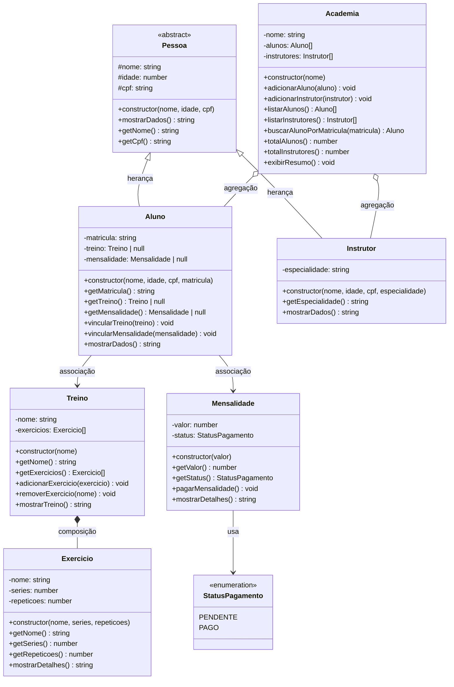

# Diagrama UML - Sistema de Academia

```mermaid
classDiagram

    class Pessoa {
        <<abstract>>
        #nome: string
        #idade: number
        #cpf: string
        +constructor(nome, idade, cpf)
        +mostrarDados() string
        +getNome() string
        +getCpf() string
    }

    class Aluno {
        -matricula: string
        -treino: Treino | null
        -mensalidade: Mensalidade | null
        +constructor(nome, idade, cpf, matricula)
        +getMatricula() string
        +getTreino() Treino | null
        +getMensalidade() Mensalidade | null
        +vincularTreino(treino) void
        +vincularMensalidade(mensalidade) void
        +mostrarDados() string
    }

    class Instrutor {
        -especialidade: string
        +constructor(nome, idade, cpf, especialidade)
        +getEspecialidade() string
        +mostrarDados() string
    }

    class Treino {
        -nome: string
        -exercicios: Exercicio[]
        +constructor(nome)
        +getNome() string
        +getExercicios() Exercicio[]
        +adicionarExercicio(exercicio) void
        +removerExercicio(nome) void
        +mostrarTreino() string
    }

    class Exercicio {
        -nome: string
        -series: number
        -repeticoes: number
        +constructor(nome, series, repeticoes)
        +getNome() string
        +getSeries() number
        +getRepeticoes() number
        +mostrarDetalhes() string
    }

    class Mensalidade {
        -valor: number
        -status: StatusPagamento
        +constructor(valor)
        +getValor() number
        +getStatus() StatusPagamento
        +pagarMensalidade() void
        +mostrarDetalhes() string
    }

    class Academia {
        -nome: string
        -alunos: Aluno[]
        -instrutores: Instrutor[]
        +constructor(nome)
        +adicionarAluno(aluno) void
        +adicionarInstrutor(instrutor) void
        +listarAlunos() Aluno[]
        +listarInstrutores() Instrutor[]
        +buscarAlunoPorMatricula(matricula) Aluno
        +totalAlunos() number
        +totalInstrutores() number
        +exibirResumo() void
    }

    class StatusPagamento {
        <<enumeration>>
        PENDENTE
        PAGO
    }

    Pessoa <|-- Aluno : herança
    Pessoa <|-- Instrutor : herança

    Aluno --> Treino : associação
    Aluno --> Mensalidade : associação

    Treino *-- Exercicio : composição

    Academia o-- Aluno : agregação
    Academia o-- Instrutor : agregação

    Mensalidade --> StatusPagamento : usa
```
